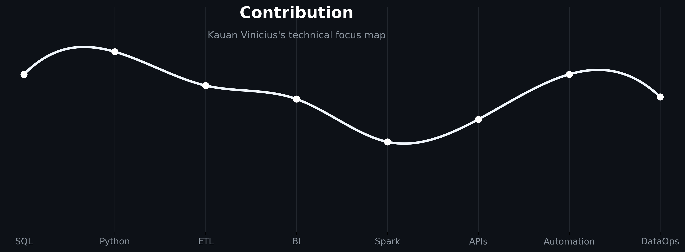

  

  
  
  

  
  
  
  

---

## Know About Me

<table>
  <tr>
    <td width="38%" valign="center">
      
    </td>
    <td width="62%" valign="top">

Hey there, I'm Kauan Vinicius, Python enthusiast.

I work at the intersection of data analysis, data engineering, DataOps and Python development, building practical automations that remove manual work and make information easier to trust.

My background includes logistics and educational environments, with experience in ETL/ELT pipelines, BI dashboards like Power BI and Streamlit, SQL modeling, NoSQL modeling, process automation, APIs, web scraping, RPA, implementations with DataOps practices and LLM integrations.

The work I enjoy most is the direct part: collecting the data, cleaning it, modeling it, automating tedious tasks, and delivering something that people can actually use. Automating and optimizing data collection, storage, processing, and distribution processes.
    </td>
  </tr>
</table>

---

## Technical Arsenal

  
  
  
  
  
  
  
  
  
  
  
  
  
  
  

<table>
  <tr>
    <td width="25%" valign="top">
      <strong>Data Engineering</strong> 
      ETL/ELT, Data Warehouse, Data Lake, Data Quality, PySpark, Databricks, IBM DataStage and Airflow.
    </td>
    <td width="25%" valign="top">
      <strong>Analytics & BI</strong> 
      Power BI, DAX, Power Query, SQL, Streamlit, KPIs, dashboards, storytelling and analytical modeling.
    </td>
    <td width="25%" valign="top">
      <strong>Python Automation</strong> 
      APIs, Selenium, n8n, Power Automate, webhooks, scheduled jobs, LLMs and structured logging.
    </td>
    <td width="25%" valign="top">
      <strong>Cloud & DataOps</strong> 
      Docker, Linux, Kubernetes, GitHub Actions, Cloud platforms and infrastructure management.
    </td>
  </tr>
</table>

---

  

## Connect

  
  
  

> Code is not finished when it runs. It is finished when the next person can understand it, trust it and change it.

> Good automation is quiet: it handles the routine, logs the important parts and leaves people with better decisions.

---

## GitHub Stats

  

---

  
  

  <strong>Automating the repetitive. Modeling the useful. Shipping the reliable.</strong>

